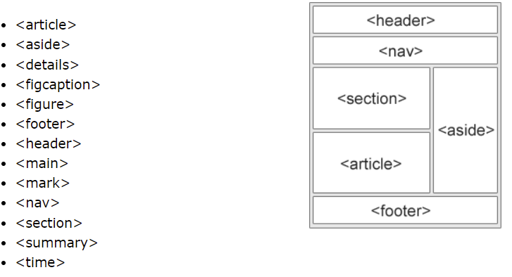
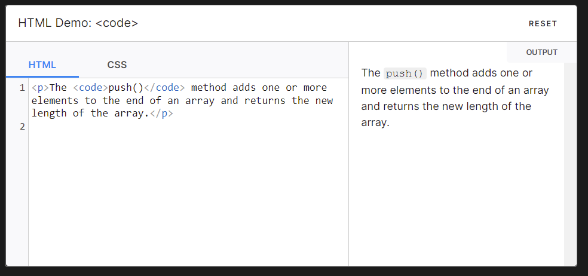
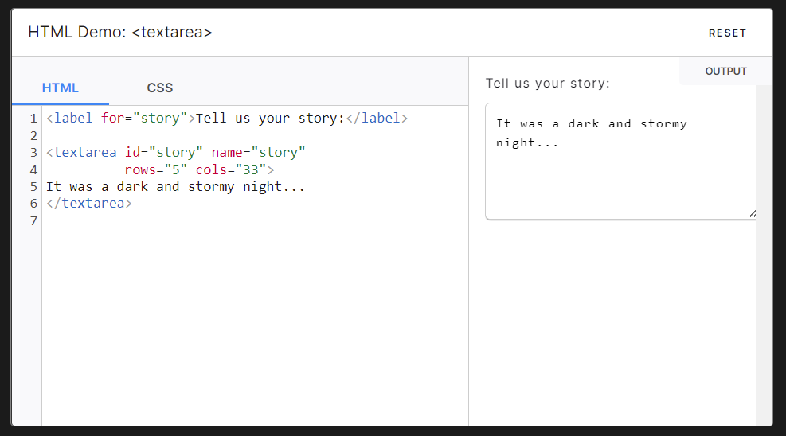
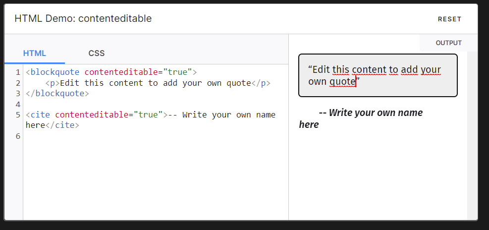
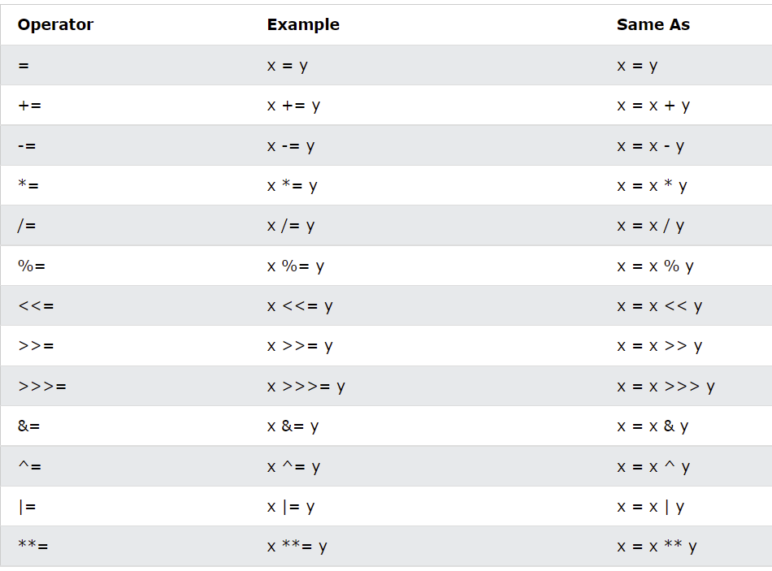

# 1. Which of the following is not a semantic element?
A. span

# 2. Which of the following specifies relationship between current document and external resource?
D. link

# 3. Which element denotes that the text is a short fragment of computer code?
C. code
<code>: The Inline Code element
The <code> HTML element displays its contents styled in a fashion intended to indicate that the text is a short fragment of computer code. By default, the content text is displayed using the user agent's default monospace font.

# 4. Who is making the Web standards?
the World Wide Web Consortium (W3C)
The central organization who is responsible for creating and maintaining web standards is the World Wide Web Consortium (W3C). The W3C has defined dozens of standards, including the standard markup languages we use to build websites.

# 5.What is the correct HTML for making a text area?
The <textarea> element

# 6. An iframe is used to display a web page within a web page.
A. True

# 7. The HTML global attribute, "contenteditable" is used to:
The contenteditable attribute specifies whether the content of an element is editable or not.

# 8. Which HTML element is used to specify a header for a document or section?
C. header

# 9. How do you group selectors?
To group selectors, separate each selector with a comma.

# 10. What is the default value of the position property?
The default value of the position property is static . The elements are displayed in the order (document flow) of what is written in the HTML.

# 11. What are JavaScript Variables?
Variable means anything that can vary. In JavaScript, a variable stores the data value that can be changed later on. Use the reserved keyword var to declare a variable in JavaScript.
JavaScript is a dynamically typed (also called loosely typed) scripting language. That is, in JavaScript variables can receive different data types over time. Datatypes are basically typed data that can be used and manipulated in a program.

# 12. Which one is not an assignment operator in JavaScript?
D. $= 

# 13. Which variable name comforms to naming rules in JavaScript?
D. age&birth 

# 14. Which Variable-defining keyword allows its variable to be accessed (as undefined) before the line that defines it?
B. let

## Interview Questions 
# 1. Briefly describe the correct usage of the following HTML5 semantic elements: header, article, section, footer
- The header> element is used to identify content that precedes the primary content of the web page and often contains website branding, navigation elements, search forms, and similar content that is duplicated across all or most pages of a website.
- The article> HTML element represents a self-contained composition in a document, page, application, or site, which is intended to be independently distributable or reusable (e.g., in syndication).
- The section> element is a generic semantic element. Use it when none of the other semantic container elements are appropriate. It combines portions of your document into discrete units that you can describe as related in some way.
- The footer> HTML element represents a footer for its nearest ancestor sectioning content or sectioning root element. A footer> typically contains information about the author of the section, copyright data or links to related documents.

# 2. Describe the relationship between the header and h1 tags in HTML5.
The head element contains meta data about the document. The header element contains any items that should contain introductory information and often includes things like h1 elements, logos, and things about the author or company.

# 3. What is the difference between span and div?
A div element is used for block-level organization and styling of page elements, whereas a span element is used for inline organization and styling.

# 4. What are the advantages of CSS?
- Better Website Speed. 
- Easier to Maintain. CSS is easy to maintain due to less maintenance time. 
- Consistent Design. 
- Time-Saving. 
- Better Device Compatibility. 
- Flexible Positioning of Design Elements.

# 5. Explain universal selector.
The CSS universal selector ( * ) matches elements of any type. Universal selectors can be namespaced when using @namespace . This is useful when dealing with documents containing multiple namespaces such as HTML5 with inline SVG or MathML, or XML that mixes multiple vocabularies.