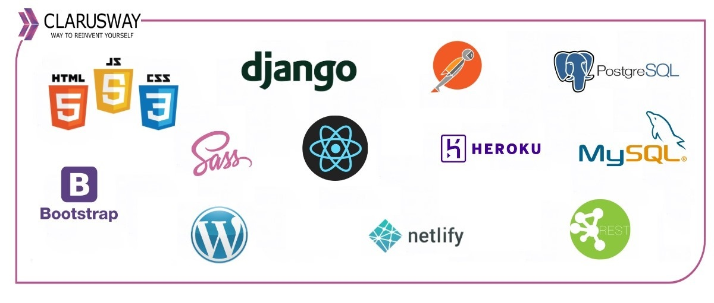
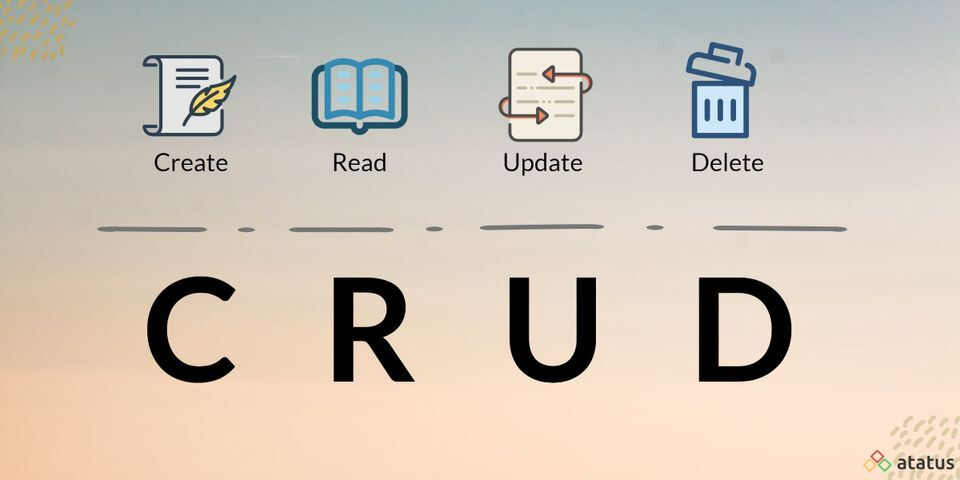

<center></center>
<br>

<center><h1> Django Class Notes</h1></center>
<p>Clarusway</p>
<br>


# CRUD

### Nice to have VSCode Extentions:
- Djaneiro - Django Snippets
- SQLite Viewer

### Needs
- Python, add the path environment variable
- pip
- virtualenv

## Summary
- Intro to CRUD
- Create project
- Secure Your Project (Decouple, Gitignore)
- Create app
- CRUD
  - List (Read)
  - Add (Create)
  - Update
  - Delete
  - Detail (Read)
- (Optional) Links to other pages
- Messages

## Intro to CRUD



## Create project

- Create a working directory, name it as you wish, cd to new directory
- Create virtual environment as a best practice:
```py
python3 -m venv env # for Windows or
python -m venv env # for Windows
virtualenv env # for Mac/Linux or;
virtualenv env -p python3 # for Mac/Linux
```
- Activate scripts:
```bash
.\env\Scripts\activate  # for Windows
source env/bin/activate  # for MAC/Linux
```
- See the (env) sign before your command prompt.
- Install django:
```bash
pip install django
```
- See installed packages:
```sh
pip freeze

# you will see:
asgiref==3.3.4
Django==3.2.4
pytz==2021.1
sqlparse==0.4.1

# If you see lots of things here, that means there is a problem with your virtual env activation. 
# Activate scripts again
```
- Create requirements.txt same level with working directory, send your installed packages to this file, requirements file must be up to date:
```py
pip freeze > requirements.txt
```

- Create project:
```py
django-admin startproject project
django-admin startproject project . 
# With . it creates a single project folder.
# Avoiding nested folders
# Alternative naming:
django-admin startproject main . 
```
- Various files has been created!
- Check your project if it's installed correctly:
```py
python3 manage.py runserver  # or,
python manage.py runserver  # or,
py -m manage.py runserver
```

## Secure your project

### .gitignore

Add standard .gitignore file to the project root directory. 

Do that before adding your files to staging area, else you will need extra work to unstage files to be able to ignore them.

### python-decouple

- To use python decouple in this project, first install it:
```py
pip install python-decouple
```

- For more information about [python-decouple](https://pypi.org/project/python-decouple/)

- Import the config object on ```settings.py``` file:
```py
from decouple import config
```

- Create .env file on root directory. We will collect our variables in this file.
```py
SECRET_KEY=o5o9...
```

- Retrieve the configuration parameters in ```settings.py```:
```py
SECRET_KEY = config('SECRET_KEY')
```
- Now you can send you project to the github, but be sure you added a .gitignore file which has .env on it.

- (Optional) If you have nested project folders with the same name; change the name of the project main (parent) directory as src to distinguish from subfolder with the same name!
```bash
# optional
mv .\project\ src
```
- Lets create first application:
- (Optional) Go to the same level with manage.py file:
```bash
# optional
cd .\src\
```

## Create App

```py
python manage.py startapp app

# Alternative naming:
python manage.py startapp home
```

## Create a Basic Model

- Go to fscohort/models.py

```python
from django.db import models

class Student(models.Model):
    first_name = models.CharField(max_length=30)
    last_name = models.CharField(max_length=30)
    number = models.IntegerField(blank=True, null=True)

    def __str__(self):
        return f"{self.first_name} {self.last_name}"
```
- Apply migrations and create a superuser to login admin page.

```bash
py manage.py makemigrations
py manage.py migrate
python manage.py createsuperuser
```

- Register your model to see in admin page. Go to fscohort/admin.py

```python
from django.contrib import admin

from .models import Student
# Register your models here.
admin.site.register(Student)
```

- Login to admin site and add student objects

- Go to Admin site and add student objects

- Create template folder as fscohort/templates/fscohort and create base.html

```html
<!DOCTYPE html>


<html lang="en">
  <head>
    <meta charset="UTF-8" />
    <meta http-equiv="X-UA-Compatible" content="IE=edge" />
    <meta name="viewport" content="width=device-width, initial-scale=1.0" />

    <link
      rel="stylesheet"
      href="https://maxcdn.bootstrapcdn.com/bootstrap/4.0.0-alpha.6/css/bootstrap.min.css"
      integrity="sha384-rwoIResjU2yc3z8GV/NPeZWAv56rSmLldC3R/AZzGRnGxQQKnKkoFVhFQhNUwEyJ"
      crossorigin="anonymous"
    />

    
    <link rel="stylesheet" href=" " />
    

    <link rel="stylesheet" href="   " />

    <title>Document</title>
  </head>

  <body>
      
    <div style="margin-top: 100px; margin-bottom: 100px" class="container">

      
    </div>
    <script
      src="https://code.jquery.com/jquery-3.2.1.slim.min.js"
      integrity="sha384-KJ3o2DKtIkvYIK3UENzmM7KCkRr/rE9/Qpg6aAZGJwFDMVNA/GpGFF93hXpG5KkN"
      crossorigin="anonymous"
    ></script>
    <script
      src="https://cdnjs.cloudflare.com/ajax/libs/popper.js/1.12.9/umd/popper.min.js"
      integrity="sha384-ApNbgh9B+Y1QKtv3Rn7W3mgPxhU9K/ScQsAP7hUibX39j7fakFPskvXusvfa0b4Q"
      crossorigin="anonymous"
    ></script>
    <script
      src="https://maxcdn.bootstrapcdn.com/bootstrap/4.0.0/js/bootstrap.min.js"
      integrity="sha384-JZR6Spejh4U02d8jOt6vLEHfe/JQGiRRSQQxSfFWpi1MquVdAyjUar5+76PVCmYl"
      crossorigin="anonymous"
    ></script>
    <script src=""></script>
  </body>
</html>
```

- Create index.html

```html
 
<h1>Home Page</h1>

<h3>Student App</h3>


```

- Go to fscohort/views.py and create a view to render home page

```python
from django.shortcuts import render

def index(request):
    return render(request, 'fscohort/index.html')
```

- Go to core/urls.py and include app urls to the list

```python
from django.contrib import admin
from django.urls import path, include

urlpatterns = [
    path('admin/', admin.site.urls),
    path('', include('fscohort.urls')),
]
```

- Go to fscohort/urls.py and specify the home url

```python
from django.urls import path
from .views import index

urlpatterns = [
    path('', index, name='home'),
]
```

- Run server and see the page!

## List (Read)

- Go to fscohort/views.py and create a view to show all students list on the page

```python
from .models import Student

def student_list(request):
    students  = Student.objects.all()
    context = {
        'students': students,
    }
    return render(request, 'fscohort/student_list.html', context)
```

- Go to fscohort/urls.py and create endpoint

```python
from django.urls import path
from .views import index, student_list

urlpatterns = [
    path('', index, name='home'),
    path('list/',student_list , name='list'),
]
```

- Create student_list.html

```html



<ul>
    
    <li>{{ student.number }} - {{student.first_name}} {{student.last_name}}</li>
    
</ul>

```

## Add (Create)

- First we need to create our form. Go to fscohort/forms.py

```python
from django import forms
from .models import Student

class StudentForm(forms.ModelForm):

    class Meta:
        model = Student
        fields = '__all__' 
        labels = {"first_name": "Adınız", "last_name":"Soyadınız", "number":"Numaranız"}
```

- Go to fscohort/views.py and write a view to add a student to the db

```python
from django.shortcuts import render, redirect
from .forms import StudentForm

def student_add(request):
    form = StudentForm() # boş form render edeceğiz
    if request.method == 'POST':          
        print(request.POST)				   
        form = StudentForm(request.POST)   
        if form.is_valid():				   
            form.save()
            return redirect("list")					   
    context = {
        'form' : form
    }
    return render(request, 'fscohort/student_add.html', context)
```

- Go to fscohort/urls.py and add url

```python
from django.urls import path
from .views import index, student_list, student_add

urlpatterns = [
    path('', index, name='home'),
    path('list/',student_list , name='list'),
    path('add/',student_add , name='add'),
]
```

- Create student_add.html

```html



    <h2>Add Student</h2>
    <form action="" method="POST">
                           
        {{form.as_p}}						   
        <input type="submit" value="add">
    </form>

```

## Update

- Go to fscohort/views.py and create a view enables to update any student with given id

```python
def student_update(request, id):
    student =Student.objects.get(id=id)
    form = StudentForm(instance=student)
    if request.method== "POST":
        form = StudentForm(request.POST, instance=student)
        if form.is_valid():
            form.save()
            return redirect("list")   
    context = {
        'form':form,
    }
    return render(request, 'fscohort/student_update.html', context)
```

- Go to fscohort/urls.py and add url

```python
from django.urls import path
from .views import index, student_list, student_add, student_update

urlpatterns = [
    path('', index, name='home'),
    path('list/',student_list , name='list'),
    path('add/',student_add , name='add'),
    path('update/<int:id>',student_update , name='update'),
]
```

- Create student_update.html

```html



    <h2>Update Student</h2>
    <form action="" method="POST">
                           
        {{form.as_p}}						   
        <input type="submit" value="update">
    </form>

```

## Delete

- Go to fscohort/views.py and write a view to delete sudent object

```python
def student_delete(request, id):
    # student = get_object_or_404(Student, id=id)
    student = Student.objects.get(id=id)
    if request.method == "POST":
        student.delete()
        return redirect("list")
    return render(request, "fscohort/student_delete.html") 
```

- Go to fscohort/urls.py and add url

```python
from django.urls import path
from .views import index, student_list, student_add, student_update, student_delete

urlpatterns = [
    path('', index, name='home'),
    path('list/',student_list , name='list'),
    path('add/',student_add , name='add'),
    path('update/<int:id>',student_update , name='update'),
    path('delete/<int:id>',student_delete , name='delete'),
]
```

- Create student_delete.html

```html




    <form action="" method="POST">
        <p>Are You Sure!</p>
        
        <input type="submit" value="Yes">
    </form>
    <a href="">
        <button>No</button>
    </a>

```

## Detail (Read)

- Go to fscohort/views.py and write a view to show the details of any student object

```python
def student_detail(request, id):        
    student = Student.objects.get(id=id)
    context = {
        'student': student
    }
    return render(request, 'fscohort/student_detail.html', context)
```

- Go to fscohort/urls.py and add url

```python
from django.urls import path
from .views import index, student_list, student_add, student_update, student_delete, student_detail

urlpatterns = [
    path('', index, name='home'),
    path('list/',student_list , name='list'),
    path('add/',student_add , name='add'),
    path('update/<int:id>',student_update , name='update'),
    path('delete/<int:id>',student_delete , name='delete'),
    path('student/<int:id>', student_detail, name="detail"),
]
```

- Create student_detail.html

```html



    {{student.number}} - {{student.first_name}} {{student.last_name}}
    <br>
    <a href=""><button>Update</button></a>
    <a href=""><button>Delete</button></a>

```

## (Optional) Links to other pages

- Go to student_list.html and add link to every student to show details

```html



<ul>
    
    <a href="">
    <li>{{ student.number }} - {{student.first_name}} {{student.last_name}}</li>
    </a>
    
</ul>

```
- Optional Challenges
  - Add student_list template "student add" button,
  - Add student_add template "cancel" button.
  
  
## Messages

- Go to base.html and add messages to the template

```html
         
         
            
                <div class="alert alert-danger">{{ message }}</div>
            
                <div class="alert alert-{{ message.tags }}">{{ message }}</div>
             
         
       
```

- Go to views.py and add your messages to your views

```python
from django.contrib import messages

            form.save()
            messages.success(request, "student created succesfully!")
            return redirect("list")
```

<br>

**<p align="center">&#9786; Happy Coding! &#9997;</p>**

<p>Clarusway</p>
